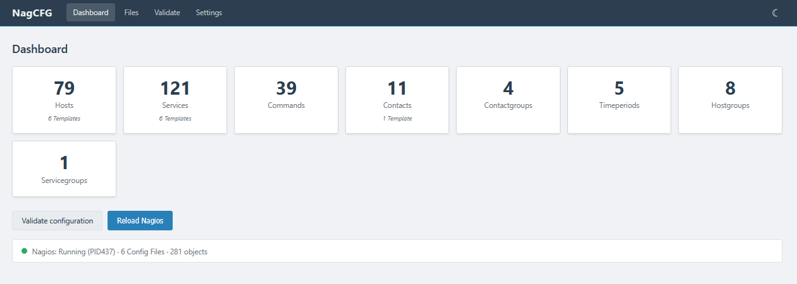
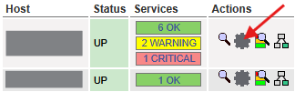
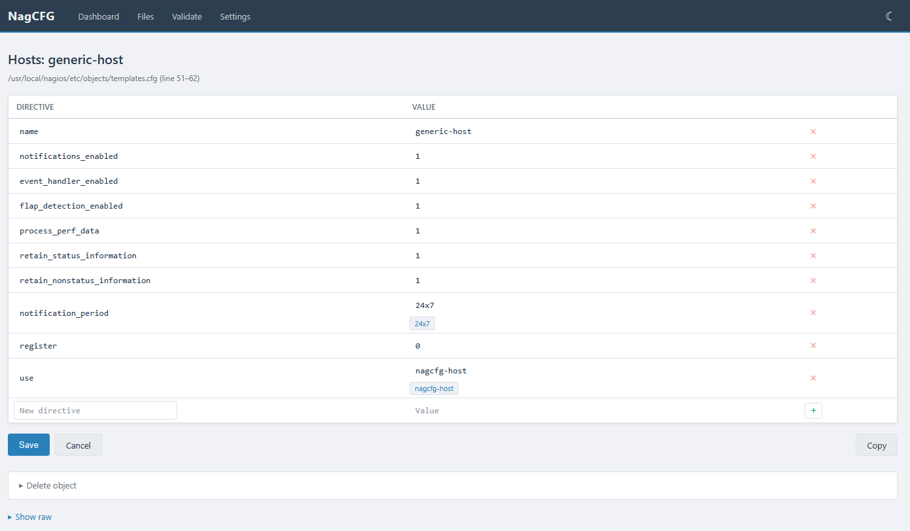
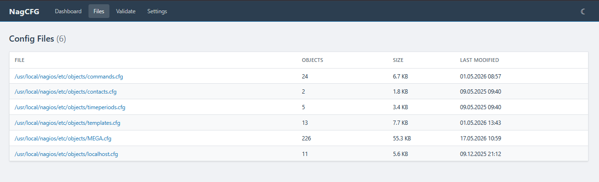
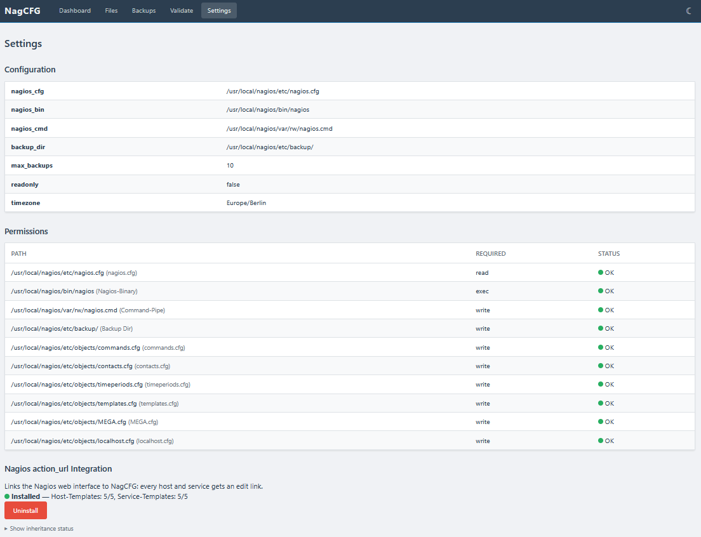
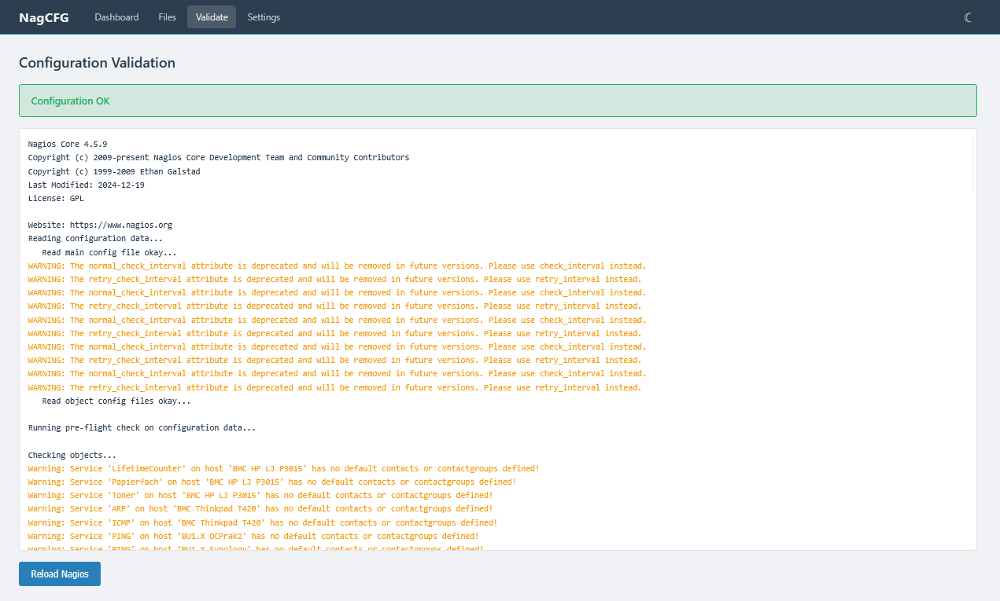
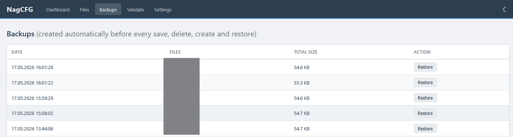

# NagCFG

Web-based configuration editor for Nagios Core 4.x. Edit, create and delete Nagios objects directly in the browser. Optionally adds a gear icon to every host and service in the Nagios web interface that links directly to the editor.



[More screenshots](#screenshots)

## Features

- Dashboard with overview of all object types and counts
- List and detail views for all Nagios object types (hosts, services, hostgroups, contacts, commands, timeperiods, etc.)
- Inline editing with autocompletion for directives and cross-references
- Create, copy and delete objects (copying a host can include its services and hostgroup membership)
- Hostgroup and servicegroup membership management directly from the edit page
- Automatic validation (`nagios -v`) and reload after every change
- Cascading rename: changing a name automatically updates all references across all config files
- Duplicate detection on rename
- Cascading delete: removing a host also deletes its services and cleans up all references
- Atomic writes with automatic backup before every change
- Transaction-based backup and restore via the Backups tab
- **[action_url integration: adds a clickable icon to every host and service in the Nagios web interface that links directly to the editor](#action_url-integration)**
- Read-only mode via configuration
- CSRF protection

## Requirements

- Nagios Core 4.x
- Apache 2.4 with mod_php
- PHP 8.0 or newer
- Debian/Ubuntu (other distributions may work with minor adjustments)

## Installation

### 1. Copy files

Copy the files to any directory accessible by the web server. Adjust the paths in `config.php` to match your Nagios installation.

### 2. Set permissions

The web server user (`www-data`) must be added to the `nagios` and `nagcmd` groups:

```bash
usermod -aG nagios www-data
usermod -aG nagcmd www-data
systemctl restart apache2
```

The Nagios configuration directories and files must be group-writable:

```bash
mkdir -p /usr/local/nagios/etc/backup
chown nagios:nagios /usr/local/nagios/etc/backup
chmod 775 /usr/local/nagios/etc/objects/ /usr/local/nagios/etc/backup/
chmod 664 /usr/local/nagios/etc/objects/*.cfg
```

### 3. Configure Apache

Set up an alias pointing to the NagCFG directory and enable `AllowOverride All` so the `.htaccess` authentication takes effect. Adjust the htpasswd path in `.htaccess` if needed.

### 4. Authentication

The included `.htaccess` uses the Nagios htpasswd file:

```apache
AuthName "NagCFG"
AuthType Basic
AuthUserFile /usr/local/nagios/etc/htpasswd.users
Require valid-user
```

## action_url integration

The settings page (`/nagcfg/?view=settings`) lets you activate the action_url integration. This creates two invisible templates (`nagcfg-host` and `nagcfg-service`) and applies them to all existing host and service templates. A gear icon then appears next to every host and service in the Nagios web interface, linking directly to the editor for that object.



The integration can be uninstalled from the same settings page.

## Files

| File | Description |
|---|---|
| `index.php` | Main application (routing, POST handlers, views) |
| `NagiosParser.php` | Parser for Nagios configuration files |
| `NagiosWriter.php` | Write operations (save, delete, append, reload) |
| `config.php` | Configuration (paths, options) |
| `style.css` | Stylesheet |
| `script.js` | Client-side JavaScript |
| `action-gear.gif` | Icon for the action_url integration |
| `.htaccess` | Apache authentication |

## Screenshots











## Notes

- **Use at your own risk.** This software is provided as-is with no warranty. Misconfiguration can break your Nagios monitoring. Always verify changes and keep backups
- This project is an independent tool and is not affiliated with or endorsed by Nagios Enterprises
- NagCFG is intended for use in trusted, internal networks only. It relies on HTTP Basic Authentication and should not be exposed to the public internet without additional security measures (HTTPS, VPN, firewall)
- Every write operation automatically creates a backup of the affected file
- The number of backups per file is configurable via `max_backups` in `config.php`
- Set `'readonly' => true` in `config.php` to disable all write access

## License

Copyright (c) 2026 RainiHeini

[GPL-3.0](https://www.gnu.org/licenses/gpl-3.0.html)
